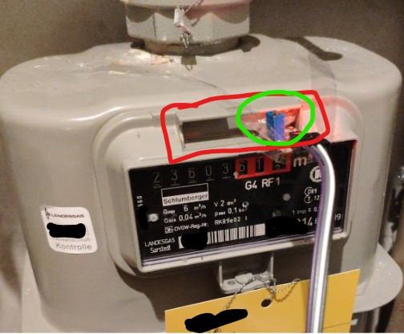
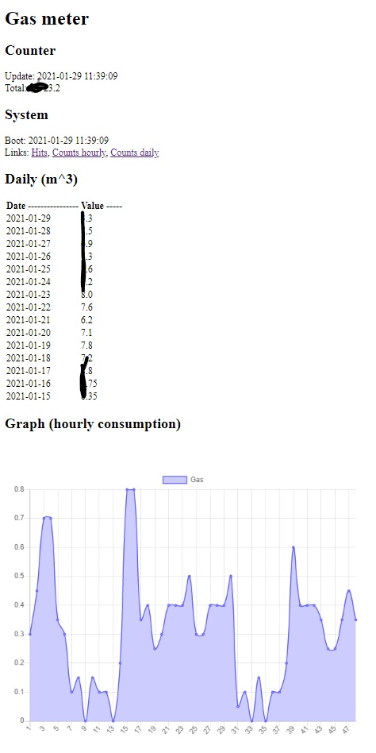

# esp32_python_gasmeter

As the name says, it is about simple, stable gasmeter readout on esp32 using micropython. It applies for gas meters with reed-type magnetic output.

## What is that

+ It is a fully standalone gas meter reader, counter with web based presentation
+ It is cheap ~10 EUR (this could be even more optimized)
+ It can be used by any person, even non-geek (especially), but clearly requires some knowledge for installation

### What it does

+ It counts signals from a meter, recalculates and presents the numbers
+ It really could count any signals going through a standard digital input
+ It does not require any external servers or anything (it could work with mqtt)

### What it does not

+ It does not run on battery... but it maybe could

## Functionality

This version includes:

+ web server running in thread - improved
+ counting total consumption (consumption added to the current counter state)
+ printing daily/hourly consumption (more precise makes no sense, less precise (months/etc) is easy to add)
+ showihg graph of signal consumption
  + using chartjs (delivering gzipped, around 70kb, with browser caching enabled)
+ log file of signals (every valid signal is logged) (expected to overfill and destroy everything in 5 years :D, to be solved)
+ auto reset if webserver fails
+ saving the data (hourly) (place for 10+ years should be available)
  + daily and total (and in future monthly ?) is recalculated from daily, so no errors expected
+ function for reset
+ function for csv export
+ INFO: reset takes ~2-4 seconds, whereas magnet signal takes at shortest 15 seconds, so even during reboot, no signal should be lost

## How does it look like ?

No external hardware is needed for calculation or presentation, everything is included.
GUI is accessible through any webbrowser (computer, mobile, etc.).

Clearly the graph is hourly (last 48 hours) and list is daily, but it is easy to change.

## Safety and security

This should not influence any hardware functionality or/and safety of the meter. Still, I do not take any responsibility for anything negative (but, I do take complete credit for anything good :D).

THe device should work in local network only. It is not really secured in any way. It does not connect to any server, with exception of explicitly defined NTP (or MQTT in future) server. For completely safety, the IoT devices should have disabled internet access anyway, and connect for MQTT and NTP to some local source.

The micropython base itself could do something what my code is not supposed to do, but I did not noticed anything. Still, this would be micropython responsibility.

# Plans

Additional idea is:

+ add mqtt connection
+ extend for other meters (water, power ?)

## Changes

+ chartist graph added, smaller js than chartjs, but less "interactive"
+ memory optimisation - array as byte array (assumed less than 25 m^3 consumption per hour :D)
  + 8kb data per year, but 400kb space available
+ page load improvement (first from 900ms, to 200ms, but dependent on data info )
+ page load improvement 2, changing only when counting triggered (from 200-400ms to 10ms)
+ switch from chartist to chartjs (larger, but easier for me)
+ introduced cache http messages to speed up loading, and lower the load on esp32

# Installation

+ flash micropython on esp32
  + this is easy, but you need to know how to do this
+ fill the secret_cfg.py file
+ fill the offset.py file
+ upload all files to esp32
  + not necesarily easy - I used webrepl, but it might require connecting to the esp32 through serial putty to connect to network
+ connect reed sensor to esp32
  + connect any power (3.3 or 5 V) from esp32 to reed
  + connect digital output from reed to pin 21 of esp32
+ place reed sensor in the sensor slot of the gas meter
+ done

There is a slot for a sensor. It is partially not important how the sensor is mounted, only the "glass-part" of the sensor has to be on the right side of the slot. My sensor is relatively large, and has a potentiometer, so it does not completely fit there (still, I will try to resolder the potentiometer, to hide the sensor in the slot).

# Requirements

You need following hardware:

+ ESP32 of almost any kind (I use https://www.amazon.de/AZDelivery-NodeMCU-Development-Nachfolgermodell-ESP8266/dp/B074RGW2VQ/)
+ reed sensor of probably any kind (I have https://www.amazon.de/gp/product/B07KTYW9DQ/)
+ some cables, usb charger for power
+ total cost expected 10 EUR

## Running currently on

Created and tested on
+ esp32-wroom-32 (from AZ-Delivery)
  + MAYBE esp8266 be possible, for lower power consumption, maybe battery run, but not sure how well micropython is running on it
+ KY-025 Reed Sensor
  + MAYBE some other sensors like simpler KY-021, or even a sensor tube without electronics might be used
  + probably KY-035 Hall sensor would be fine
  + even built-in in esp32 hall sensor might be fine (not tested, and it would require esp32 very near to the gasmeter)
+ micropython, esp32-idf4-20201114-unstable-v1.13-173-g61d1e4b01.bin (https://micropython.org/download/esp32/)

# Meter hardware

Gas meter info:

+ Schlumberger G4 RF1 (with 1 impulse per 0.1 m^3) 
  + impulse is sent on (magnet is near) between values x.x7 to x.x8 on the counter 
  + impulse is strong and clear, with shortest lifetime of 15 seconds 
  + due to this rule, impulse is counted (is valid) only if lasts 3-5 seconds (to avoid noise) 
  + this would need to be corrected for counters with higher resolution per impulse (still, the sensor is fast enough to handle it easily) 
+ would work with any meter of this kind
  + presumably there are also water meters with this kind of output

# Connected projects

Connected projects

+ chart js
  + I exchanged chartist with chartjs, with which I am more familiar with
  + https://github.com/chartjs/Chart.js
+ Chartist js
  + compressed js and css files are used for charts
  + https://github.com/gionkunz/chartist-js
+ Base for webserver in micropython
  + web server serving significantly improved, less memory usage
  + https://github.com/yunnanpl/esp32_python_web

## Similar projects

Similar projects/approaches for the same kind of meters, or other meters

+ gas
  + https://github.com/michsvob/digit-recognition
  + https://github.com/ParalelniPolis/ppplyn
  + https://github.com/deviant-studio/energy-meter-scanner
  + https://github.com/RolandColored/smartmeter
  + https://github.com/francescovannini/espmeter
    + battery driven, also magnetic sensor
  + https://github.com/murdho/pi-read-meter
+ power
  + https://github.com/spidgorny/energy-monitor
  + I solved mine with Shelly 3EM... with 1.02 calibration factor, it works perfectly ( get support from electrician ! )
    + I know it is 120 EUR, but it is worth it (if you do not have a smart meter with some kind of output, like me)
+ water
  + https://github.com/yamaton/water-meter-reading
